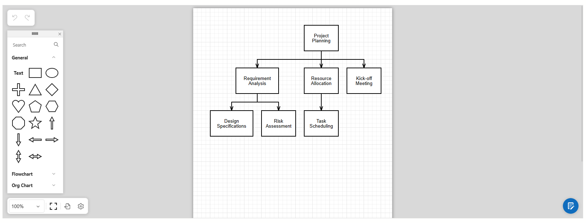

# Blazor - Use DevExtreme Diagram in Blazor Applications

This example adds the [DevExtreme Diagram widget](https://js.devexpress.com/jQuery/Demos/WidgetsGallery/Demo/Diagram/Overview/MaterialBlueLight/) into your Blazor application. 



## Implementation Details

### Register DevExtreme Resources

DevExtreme widgets require the use of [DevExtreme scripts and stylesheets](https://js.devexpress.com/jQuery/Documentation/Guide/jQuery_Components/Add_DevExtreme_to_a_jQuery_Application/). You must register scripts in the following order:

1. JQuery library (`https://code.jquery.com/jquery-3.5.1.min.js>`)
2. Custom or component-specific scripts, for example, diagram (`https://cdn3.devexpress.com/jslib/25.1.3/js/dx-diagram.min.js`)
3. Base DevExtreme script (`https://cdn3.devexpress.com/jslib/25.1.3/js/dx.all.js`)

The DevExpress Blazor [Resource Manager](https://docs.devexpress.com/Blazor/DevExpress.Blazor.DxResourceManager) automatically registers JQuery and standard DevExtreme scripts if your project includes the *DevExpress.Blazor* package. To load component-specific DevExtreme resources correctly, you must:

* Unregister JQuery and base DevExtreme scripts using the `DxResourceManager.RegisterScripts` method.
* Reference scripts in the `<head>` section of the [Components/App.razor](CS/DiagramBlazorApp/Components/App.razor) file.

```Razor
<head>
    <!--...-->
    <script type="text/javascript" src="https://code.jquery.com/jquery-3.5.1.min.js"></script>
    <script src="https://cdn3.devexpress.com/jslib/25.1.3/js/dx-diagram.min.js"></script>
    <script type="text/javascript" src="https://cdn3.devexpress.com/jslib/25.1.3/js/dx.all.js"></script>
    @DxResourceManager.RegisterTheme(ThemesService.ActiveTheme)
    @DxResourceManager.RegisterScripts((config) => {
        config.Unregister(CommonResources.JQueryJS);
        config.Unregister(CommonResources.DevExtremeJS);
    })
    <link rel="stylesheet" href="https://cdn3.devexpress.com/jslib/25.1.3/css/dx-diagram.min.css">
    <link href=@AppendVersion("https://cdn3.devexpress.com/jslib/25.1.3/css/dx.fluent.blue.light.css") rel="stylesheet" />
    <!--...-->
</head>
```

### Implement a Wrapper

Implement a Blazor component that wraps DevExtreme Diagram. The wrapper consists of two files:

* [DevExtremeDiagram.razor.js](CS/DiagramBlazorApp/DevExtremeComponents/DevExtremeDiagram.razor.js) configures Diagram settings (binds the component to a data model defined in the [ProjectTask.cs](CS/DiagramBlazorApp/Model/ProjectTask.cs) file).
    ```javascript
    export async function initializeDiagram(element, dataSource) {
         const projectTasks = !!dataSource ? dataSource : null;
    
         return $(element).dxDiagram({
             nodes: {
                 dataSource: new DevExpress.data.ArrayStore({
                     key: 'id',
                     data: projectTasks,
                 }),
                 keyExpr: "id",
                 parentKeyExpr: "parent_ID",
                 textExpr: "task_Name",
             },
         });
    }
    ```
* [DevExtremeDiagram.razor](CS/DiagramBlazorApp/DevExtremeComponents/DevExtremeDiagram.razor) renders the Diagram. In this file, call the [LoadDxResources](https://docs.devexpress.com/Blazor/DevExpress.Blazor.DxResourceManager.LoadDxResources(Microsoft.JSInterop.IJSRuntime)) method to force the `Resource Manager` to load all client scripts.
    ```razor
    <div @ref="Diagram"></div>
    ```

    ```csharp
        protected override async Task OnAfterRenderAsync(bool firstRender) {
            if (firstRender) {
                await JS.LoadDxResources();
                ClientModule = await JS.InvokeAsync<IJSObjectReference>("import", "./DevExtremeComponents/DevExtremeDiagram.razor.js");
                ClientDiagram = await ClientModule.InvokeAsync<IJSObjectReference>("initializeDiagram", Diagram, DataSource);
            }
            await base.OnAfterRenderAsync(firstRender);
        }
    ```

### Render the Blazor component

Use the wrapper as a standard Blazor component. The following code adds a `DevExtremeDiagram` wrapper to the page and binds it to data:

```razor
<DevExtremeDiagram DataSource="DataSource" />

@code {
    List<ProjectTask> DataSource { get; set; }

    protected override void OnInitialized() {
        DataSource = new() {
            new() { ID = 1, Task_Name = "Project Planning", Description = "Define project scope and goals" },
            new() { ID = 2, Parent_ID = 1, Task_Name = "Requirement Analysis", Description = "Gather and document requirements" },
            // ...
        };
    }
}
```

## Files to Review

* [Diagram.razor](CS/DiagramBlazorApp/Pages/Index.razor)
* [DevExtremeDiagram.razor](CS/DiagramBlazorApp/DevExtremeComponents/DevExtremeDiagram.razor)
* [DevExtremeDiagram.razor.js](CS/DiagramBlazorApp/DevExtremeComponents/DevExtremeDiagram.razor.js)
* [ProjectTask.cs](CS/DiagramBlazorApp/Model/ProjectTask.cs)
* [App.razor](CS/DiagramBlazorApp/Pages/App.razor)

## Documentation

* [Get Started with DevExtreme jQuery/JS](https://js.devexpress.com/jQuery/Documentation/Guide/Common/First_Steps/)
* [Get Started with JavaScript/jQuery Diagram](https://js.devexpress.com/jQuery/Documentation/Guide/UI_Components/Diagram/Getting_Started_with_Diagram/)
* [Add DevExtreme Components to a Blazor Application](https://docs.devexpress.com/Blazor/403578/components/devextreme-components-in-blazor)
* [DxResourceManager](https://docs.devexpress.com/Blazor/DevExpress.Blazor.DxResourceManager)

## More Examples

* [Blazor - Use DevExtreme Circular Gauge in a Blazor Application](https://github.com/DevExpress-Examples/blazor-use-devextreme-circular-gauge)

<!-- feedback -->
=======
<!-- default badges list -->

[](https://supportcenter.devexpress.com/ticket/details/T905033)
[](https://docs.devexpress.com/GeneralInformation/403183)
[](#does-this-example-address-your-development-requirementsobjectives)
<!-- default badges end -->
# Diagram - How to integrate the widget into Blazor applications

## Requirements
- To use the RichEdit control in an Blazor application, you need to have a [Universal, DXperience, ASP.NET or DevExtreme subscription](https://www.devexpress.com/buy/net/).
- Versions of the devexpress npm packages should be identical (their major and minor versions should be the same).

This example illustrates a possible way to integrate the Diagram widget into Blazor applications. This can be done as follows:
1. Create a new Blazor application using recommendations from the following topic: [Get started with ASP.NET Core Blazor](https://docs.microsoft.com/en-us/aspnet/core/blazor/get-started?view=aspnetcore-3.1&tabs=visual-studio).
2. Install the necessary DevExtreme and Diagram resources by following steps from the following help topic: [Getting Started with Diagram](https://js.devexpress.com/Documentation/Guide/Widgets/Diagram/Getting_Started_with_Diagram/).
3. Register the resources from the previous step. In Blazor server applications, use the ```Pages/_Host.cshtml``` file's HEAD section. In Blazor WebAssembly, use the ```wwwroot/index.html``` file's HEAD section.

```html
<head>
    <!--...-->
    <link rel="stylesheet" href="https://cdn3.devexpress.com/jslib/20.1.4/css/dx.common.css">
    <link rel="stylesheet" href="https://cdn3.devexpress.com/jslib/20.1.4/css/dx.light.css">
    <script src="https://code.jquery.com/jquery-3.5.1.min.js"></script>
    <link rel="stylesheet" href="https://cdn3.devexpress.com/jslib/20.1.4/css/dx-diagram.min.css">
    <script src="https://cdn3.devexpress.com/jslib/20.1.4/js/dx-diagram.min.js"></script>
    <script type="text/javascript" src="js/diagram-init.js"></script>
    <script type="text/javascript" src="https://cdn3.devexpress.com/jslib/20.1.4/js/dx.all.js"></script>
</head>
```

4. Create the *wwwroot/js/diagram-init.js file and implement the logic to initialize the Diagram widget:

```javascript
window.JsFunctions = {
    InitDiagram: function () {
        var diagram = $("#diagram").dxDiagram()
            .dxDiagram("instance");

        $.ajax({
            url: "https://js.devexpress.com/Demos/WidgetsGallery/JSDemos/data/diagram-flow.json",
            dataType: "text",
            success: function (data) {
                diagram.import(data);
            }
        });
    }
};
```

5. Invoke the created ```InitDiagram``` method in the *OnAfterRender* lifecycle event handler:

```csharp
protected override void OnAfterRender(bool firstRender)
{
	JSRuntime.InvokeAsync<object>("JsFunctions.InitDiagram");
}
```

<!-- default file list --> 
*Files to look at*:

* [Index.razor](./CS/Pages/Index.razor)
* [index.html](./CS/wwwroot/index.html)
* [diagram-init.js](./CS/wwwroot/js/diagram-init.js)
<!-- default file list end -->
<!-- feedback -->
## Does this example address your development requirements/objectives?

[](https://www.devexpress.com/support/examples/survey.xml?utm_source=github&utm_campaign=diagram-how-to-integrate-the-widget-into-blazor-applications&~~~was_helpful=yes) [](https://www.devexpress.com/support/examples/survey.xml?utm_source=github&utm_campaign=diagram-how-to-integrate-the-widget-into-blazor-applications&~~~was_helpful=no)

(you will be redirected to DevExpress.com to submit your response)
<!-- feedback end -->
